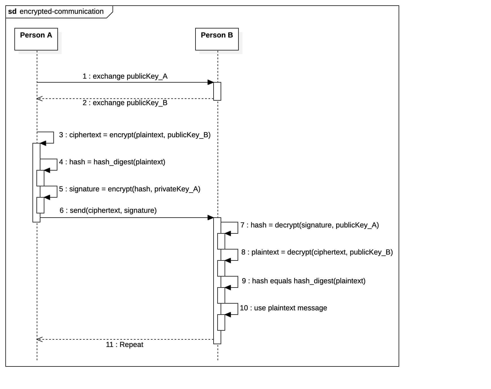
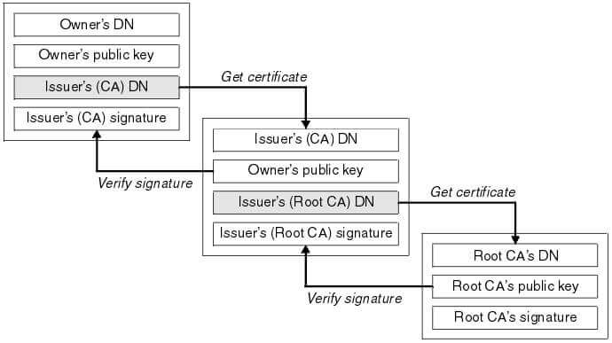

# 数字证书

## 加密传输过程

**加密只能保证数据保密性，不能解决身份信任问题。**



1. **公钥交换**:
    1. Person A 将其公钥交给 Person B `step1`
    2. Person B 将其公钥交给 Person A `step2`

2. **消息加密与签名** (由 Person A 完成):
    1. 使用 Person B 的公钥加密明文，生成密文 `step3`
    2. 对明文进行哈希摘要，得到摘要结果 `step4`
    3. 使用 Person A 的私钥加密摘要结果，生成签名 `step5`
    4. 将密文和签名一起发送给 Person B `step6`

3. **消息解密与验证签名** (由 Person B 完成):
    1. 使用 Person A 的公钥解密签名，得到原始的摘要结果 `step7`
    2. 使用 Person B 的私钥解密密文，得到明文 `step8`
    3. 对解密得到的明文进行哈希摘要
        1. 若此摘要与步骤 **3.1** 得到的摘要相匹配，证明数据完整且未被篡改 `step10`
        2. 若不匹配，证明数据已被篡改

虽然非对称加密增加了安全层，但在密钥交换过程中，攻击者通过替换通信双方的公钥为自己的，仍然可以进行中间人攻击。

## 数字证书

数字证书解决了在网络通信中验证通信方身份的问题，它通过由可信任的证书颁发机构（CA）签发的数字签名证书来验证和确认通信方的身份。

除了由可信任的证书颁发机构（CA）签发的数字证书外，还存在自签名证书。自签名证书是由实体（例如个人、组织或服务器）自行签署的数字证书，而不是由外部CA签发。

### 权威CA机构

权威机构颁发的证书下载下来一般包含 **.pem** 和 **.key** 两个文件，其中 .key 是证书的私钥，.pem 包含了证书链：

- 服务器端证书(叶子证书)
- 中间CA证书
- 不包含根CA证书

权威CA机构的根证书内嵌在浏览器/操作系统里了，无需由服务端提供，也无需客户端手动信任。

### 自签名证书

自签名证书需要客户端手动信任，通常用于以下情况：

1. **开发和测试环境**：在开发和测试阶段，可以使用自签名证书来模拟数字证书的使用，而无需花费时间和金钱获取CA签发的证书。
2. **内部网络**：某些组织可能在内部网络中使用自签名证书，以满足其内部安全需求。这些证书通常不会被外部信任。
3. **个人用途**：个人也可以为其自己的网站或服务创建自签名证书，以便加密和验证通信。

尽管自签名证书在特定情况下很有用，但它们通常不会被公共网络和浏览器信任，因为它们不经过第三方验证。为了建立受信任的安全通信，通常需要由受信任的CA签发的证书。自签名证书通常适用于受限环境或用于临时目的。

**openssl 创建自签名证书**：

```shell
# 生成 2048 位RSA私钥  
openssl genrsa -out server.key 2048  

# 根据 server.key 私钥生成证书签名请求(CSR)  
openssl req -new -key server.key -out server.csr  

# 自签名证书，使用 server.key 对 server.csr 文件进行签名，生成 server.crt 证书，有效期365天  
openssl x509 -req \
            -days 365 \
            -in server.csr \ 
            -signkey server.key \
            -out server.crt

# 将 server.key 私钥转成加密 PKCS#8 格式，输出到 server.key.encrypted 文件中，但没有设置加密密码(-nocrypt)  
openssl pkcs8 -topk8 \
           -inform PEM \
           -outform PEM \  
           -in server.key \
           -out server.key.encrypted \
           -nocrypt
```

## 证书链验证

客户端验证证书链的过程：

1. 客户端将收到从服务器端发送来的证书组成一个链。通常包含服务器证书、中间CA证书。
2. 客户端需要有一个可信的根CA证书，通常预置在操作系统或浏览器中。
3. 客户端从收到的证书链中取出最顶级的证书，也就是服务器端证书。
4. 比较服务器证书的颁发者与可信根CA，或者与中间CA之一是否匹配。如果都不匹配，则验证失败。
5. 如果匹配某中间CA，则使用该CA的公钥验证服务器证书签名是否有效。无效则失败。
6. 然后递归对链中的每个上级中间 CA证书做同样的验证，直到最终验证到可信根CA。
7. 在这个递归验证过程中，任何一个证书的签名验证失败，或者无法连续追溯到可信CA，整个证书链验证都失败。
8. 如果全部成功，则表明从服务器端证书到可信CA的完整证书链是连续有效的，证书链验证通过。

通过这种递归验证，可以完整确认从服务器端到根CA的证书链的可信性。客户端需要预置可信任的根CA证书(含手动信任的)作为最终锚点。



具体验证过程：

1. 获取顶级证书(服务器端证书)，检查 Issuer 字段
2. 在证书存储中找到具有匹配 Subject 的中级CA证书
3. 使用该中级CA证书的公钥验证顶级证书的签名
4. 然后以该中级CA证书为新的顶级证书，重复步骤1-3
5. 递归验证，直到找到预置的可信根CA证书，并用其公钥成功验证签名
6. 如果任何步骤失败，则证书链验证失败

从顶级证书出发，根据 Issuer 递归向上逐级查找父证书，并用父证书公钥验证子证书签名。

## 延伸阅读

- [什么是 SSL 证书？](https://www.cloudflare.com/zh-cn/learning/ssl/what-is-an-ssl-certificate/)