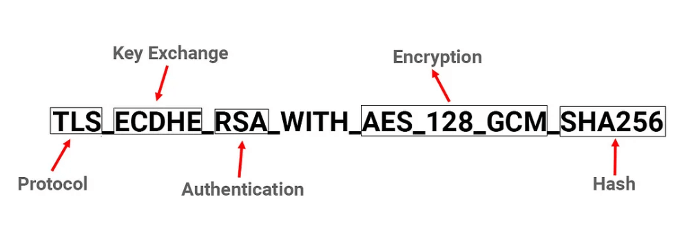

# 加密通信协议

## JWT

JWT 的核心意图是确保令牌的完整性和真实性，它通常由三个部分组成，这三个部分使用点号（.）分隔开来，分别是：

**1. Header**：JWT的头部通常包含两部分信息：声明类型（typ）和所使用的签名算法（alg）。头部通常会被Base64Url 编码。

例如：`{ "alg": "HS256"，"typ": "JWT" }`
在这个示例中，`alg`指定了签名算法为HS256，`typ`指定了声明类型为JWT。

**2. Payload**：负载部分包含了JWT的主要信息，也被称为声明。声明可以分为三种类型：
常见的标准声明：iss(发行者)、sub(主题)、exp(过期时间)等。

**3. Signature**：签名部分使用指定的算法对头部和负载进行签名，以确保JWT的完整性和真实性。签名的生成过程如下：

- 首先，将头部和负载分别使用Base64Url编码，得到两个字符串。
- 然后，将这两个编码后的字符串用点号连接起来，得到一个待签名的字符串。
- 最后，使用指定的签名算法（如HS256）和密钥对待签名字符串进行签名，生成最终的签名值。

```text
signature = SHA256(base64UrlEncode(header) + "." + base64UrlEncode(payload), secret)
```

总之，JWT包含了头部、负载和签名三个部分，头部包含签名算法和声明类型，负载包含各种声明信息，头部和负载是不加密的(只是Base64编码)，签名用于验证JWT的完整性和真实性。签名算法可以根据需要选择不同的算法，常见的有HS256、RS256等。

## TLS/SSL

### 密码套件



- **TLS**：表示这是用于 TLS 协议的密码套件
- **ECDHE**：密钥交换算法
- **RSA**：服务端的算法认证算法，使用 RSA 算法进行签名
- **WITH**：分隔符
- **AES_128_GCM**：数据加密算法，GCM 是加密模式
- **SHA256**：消息认证和完整性检验

### 握手过程

以 RSA 为密钥交换算法为例：

1. 客户端请求：`Client Hello ①`
    1. 支持的 TLS 协议版本，例如 TLSv1.2
    2. 一系列支持的[密码套件](#密码套件)，例如 `TLS_RSA_WITH_AES_128_GCM_SHA256`
    3. 一系列支持的数据压缩算法
    4. 客户端随机数，32 Bytes，用于稍后产生对称加密的密钥
    5. 可选的 SessionID，指的是传输安全层的 Session，用于 TLS 连接复用
    6. 其他可扩展信息
2. 服务端回应：`Server Hello ②`
    1. 确认使用的 TLS 协议版本
    2. 确认使用的密码套件
    3. 确认使用的数据压缩算法
    4. 服务端随机数，32 Bytes，用于稍后产生对称加密的密钥
    5. 一个 SessionID，以后可以通过连接复用减少一轮握手
    6. 其他可扩展信息
    7. `Certificate ③` X.509 证书(序列号，签发者信息，主题信息，有效期，公钥，签名，中间证书)
3. 客户端确认：Client Handshake Finished
    1. [验证证书有效性](./digital-certificate.md)
    2. `Client Key Exchange ④` 第三个随机数，32 Bytes，用服务端证书公钥加密，它被称为 **PreMasterSecret**
    3. **MasterSecret** = 特定算法(客户端随机数，服务端随机数，PreMasterSecret)
    4. `Change Cipher Spec ⑤` 编码改变通知，表示后续信息都将用双方商定的加密方法和密钥发送
    5. `Encrypted Handshake Message ⑥` 客户端握手结束通知，发送前面发送的所有内容的哈希值，以供服务端校验(加密传输)
4. 服务端确认：Server handshake Finished
    1. 用私钥解密 PreMasterSecret，再跟客户端一样用三个随机数计算出 MasterSecret
    2. `Change Cipher Spec ⑦` 编码改变通知，表示后续信息都将用双方商定的加密方法和密钥发送
    3. `Encrypted Handshake Message ⑧` 服务端握手结束通知，发送前面发送的所有内容的哈希值，以供客户端校验(加密传输)

**额外说明：**

1. 客户端也可以有证书，部分服务端不是面向全公众的，此场景可让客户端发送它自身的证书来证明身份。如果不发送或者不是预期内的，服务端可以拒绝握手。这被称为 "双向 TLS" (Mutual TLS，简写为 mTLS)。
2. 密钥交换过程不一定依赖证书的公钥，取决于密钥交换算法，例如使用 匿名 ECDH 不需要依赖公钥。
3. RSA 密钥交换算法只是为了好举例，它无法提供前向安全，实际大多是使用更安全的 ECDHE 密钥交换算法。 

## 延伸阅读

- [什么是 TLS (传输层安全)？](https://www.cloudflare.com/zh-cn/learning/ssl/transport-layer-security-tls/)
- [凤凰架构/架构安全性/传输](https://icyfenix.cn/architect-perspective/general-architecture/system-security/transport-security.html)
- [Backend Developer Roadmap](https://roadmap.sh/backend)
