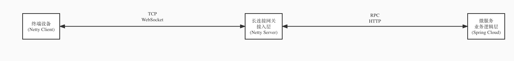
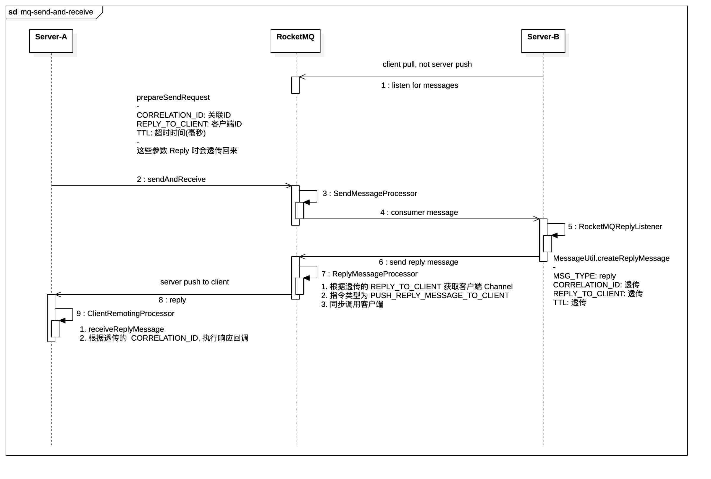

# RocketMQ sendAndReceive

接入层 与 业务逻辑层通过 RocketMQ 的 [请求 应答语义](https://github.com/apache/rocketmq-spring/wiki/%E8%AF%B7%E6%B1%82-%E5%BA%94%E7%AD%94%E8%AF%AD%E4%B9%89%E6%94%AF%E6%8C%81) 实现指令分发处理与答复，好奇是怎么实现的所以看了下源码。

核心调用流程如下：

1. **Producer** Send And Receive & [prepareSendRequest](https://github.com/apache/rocketmq/blob/release-4.9.4/client/src/main/java/org/apache/rocketmq/client/impl/producer/DefaultMQProducerImpl.java#L1563)
2. **Broker** SendMessageProcessor
3. **Consumer** RocketMQReplyListener & [Send Reply Message](https://github.com/apache/rocketmq-spring/blob/release-2.2.1/rocketmq-spring-boot/src/main/java/org/apache/rocketmq/spring/support/DefaultRocketMQListenerContainer.java#L396)
4. **Broker** ReplyMessageProcessor & [Call Client](https://github.com/apache/rocketmq/blob/release-4.9.4/broker/src/main/java/org/apache/rocketmq/broker/processor/ReplyMessageProcessor.java#L185)
5. **Producer** ClientRemotingProcessor & [Receive Reply](https://github.com/apache/rocketmq/blob/7043211302431a809a8d446f2ac21b0d54917f5c/client/src/main/java/org/apache/rocketmq/client/impl/ClientRemotingProcessor.java#L279)

| Property Key    | Description                               |
|-----------------|-------------------------------------------|
| REPLY_TO_CLIENT | 发起 sendAndReceive 的客户端ID，用于 Reply 到发起的客户端 |
| CORRELATION_ID  | 关联ID，应答时带回，用于串连请求响应                       |
