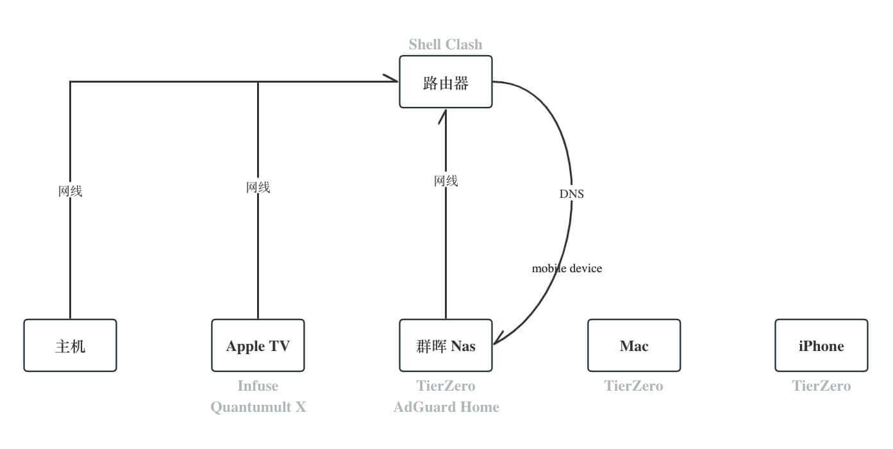

# 家庭网络搭建



## Apple TV 科学上网

tvOS 17 之前苹果没有开放 Network Extension 模块，应用市场没有 VPN 相关应用。 因此在此之前只能在路由器配置科学上网，例如
OpenWrt 或者 OpenClash。

在 tvOS 17 发布之后直接在应用市场安装 VPN(Quantumult X)，速度更快。

Notice: 不使用 OpenClash 的原因是偶尔会不稳定，配置起来也不方便，所以还是更推荐 "各管各的"，独自按需配置。

## 外部网络访问家里的 NAS

### ZeroTier

使用 ZeroTier 创建安全的虚拟子网，需要在每台设备上安装 ZeroTier 客户端，并加入已创建的网络。

- 入门指南：[Getting Started](https://docs.zerotier.com/getting-started/getting-started)
- 在Synology Nas上使用ZeroTier：[教程](https://docs.zerotier.com/devices/synology/)

Notice：
- 如果管理面板显示一切正常（已认证，活跃状态），但ping不通，耐心等待几分钟再试试。
- 可能会偶尔出现短暂无法访问的情况，随后自行恢复。这可能是公司网络DNS遭受污染或网络波动引起的。

## DNS 防劫持

### AdGuard Home

使用 AdGuard Home 的主要目的是防止 DNS 劫持，其次才是广告过滤。

将 AdGuard Home 安装在 Nas 上，然后在路由器上配置 DNS 地址指向 Nas。

- AdGuard Home Docker镜像：[Docker Hub](https://hub.docker.com/r/adguard/adguardhome)
- 安装和使用AdGuard Home指南：[教程](https://sspai.com/post/63088)

推荐的上游DNS服务器：

```text
https://dns.google:443/dns-query
https://dns.alidns.com/dns-query
```

Bootstrap DNS 服务器可根据地区选择运营商 DNS 地址，例如广州电信 DNS。